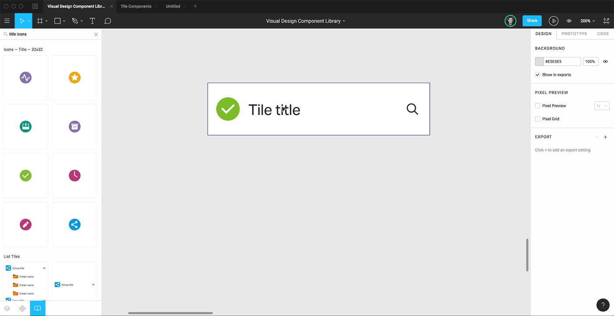
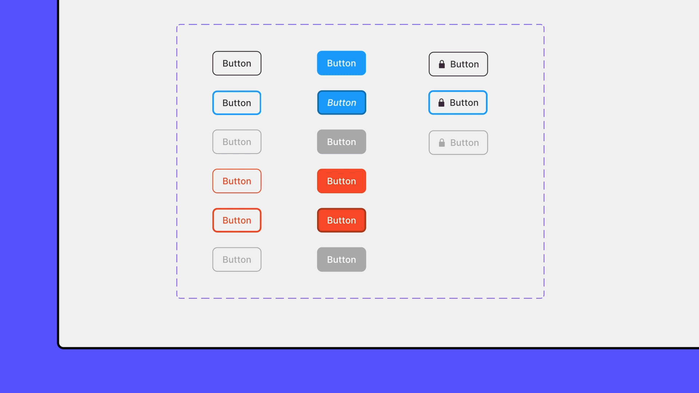
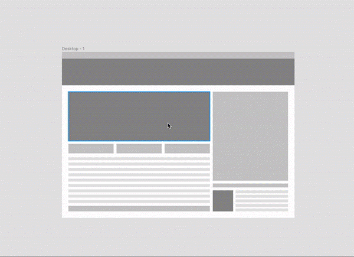
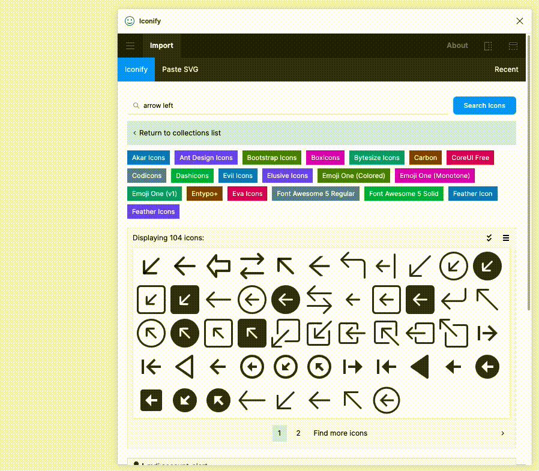

### Advice

To excel as a UX designer, immerse yourself in various design systems; kickstart your journey with the [Material UI](https://m3.material.io/) design system to grasp foundational principles and enhance your design fluency.

### 1. Leverage Figma's Resources for Efficiency and Consistency

- Always use Figma's component library or explore the Figma Community for designing basic elements like forms, buttons, and icons. This not only saves time but ensures consistency and quality in your designs.
- **Pro Resource:** [Magic UI Design](https://magicui.design/)

### 2. Use Base Components

- Start with base components when designing in Figma. Think of these as your master templates. For example, if you have multiple button styles and want to change their corner radius from 6px to 11px, you only need to update the base component, and all variations will update automatically. This saves time and ensures consistency.
- **Tip:** Create a base component with all necessary elements like icons and hover states. Then, you can easily hide or show different parts as needed.

### 3. Apply Styles to Every Design

- Styles in Figma are like paint and brushes for an artist. Use them for colors, text effects, and strokes. When you want to change a color or font style, you can update it once, and it will reflect everywhere. This method not only makes your design process faster but also keeps everything consistent.
- **Tip:** Use the color picker (dropper tool) to fill colors in your design easily.

### 4. Streamline Design Organization with Frames

- Frames in Figma are like folders that help you keep your designs neat and organized. Instead of using groups or rectangles, use frames for everything. They offer more features and make your design easier to manage.
- **Pro Tip:** Frames are versatile. Use them for layout grids, auto-layouts, constraints, and styles to streamline your design process.

### 5. Make Use of Constraints

- Constraints tell Figma how elements should behave when you resize frames. This feature ensures your design looks good on different screen sizes without manual adjustments.
- **Tip:** Hold CMD (on Mac) or CTRL (on Windows) while resizing a frame to ignore constraints temporarily.

### 6. Keep/Place Icon Vectors Inside Frames

- To make icons look uniform, place each icon inside a frame of consistent size (like 24x24 pixels). Adjust the padding inside the frame to ensure they are evenly spaced.

### 7. "Tidy" Spacing Between Objects

- Use the "tidy" button in Figma to align and space objects evenly. These practices help you create professional and clean designs efficiently, making your workflow smoother and more enjoyable.

### 8. Quickly Measure Distances Between Objects

- Instead of hoping that everything is spaced correctly, Figma allows you to measure distances between frames, groups, and components to ensure it is. To start measuring, select the first object on the canvas. Next, hold down your keyboard’s modifier key (⌥ Option on Mac and Alt on Windows). As you hover over the second object, Figma will present a red line between the two objects and the distance between them in pixels.

### 9. Boost Your Design Efficiency with Figma Plugins

- Utilize Figma plugins to boost your productivity and design capabilities. Plugins can automate repetitive tasks, provide additional design resources, and integrate with other tools.
- For example, use the "Unsplash" plugin to quickly add high-quality images or the "Stark" plugin for accessibility checks. Explore the Figma Community to find plugins that best fit your needs and streamline your design process.
- **Some useful plugins:**
  - Iconify - lets you integrate icons from Material Design
  - Blush - can create your own excellent illustrations
  - TypeScales - provides a convenient way to generate and manage consistent typographic scales within design projects.
  

#### Resources and Links

- [Material UI Design System](https://m3.material.io/)
- [Magic UI Design](https://magicui.design/)
- [Figma Community](https://www.figma.com/community/)
- [Unsplash Plugin](https://www.figma.com/community/plugin/834258472722859724/Unsplash)
- [Stark Plugin](https://www.figma.com/community/plugin/732313180182467504/Stark)
- [Iconify Plugin](https://www.figma.com/community/plugin/735098390272716711/Iconify)
- [Blush Plugin](https://www.figma.com/community/plugin/814381112123728319/Blush)
- [TypeScales Plugin](https://www.figma.com/community/plugin/735949571238716329/Type-Scales)
